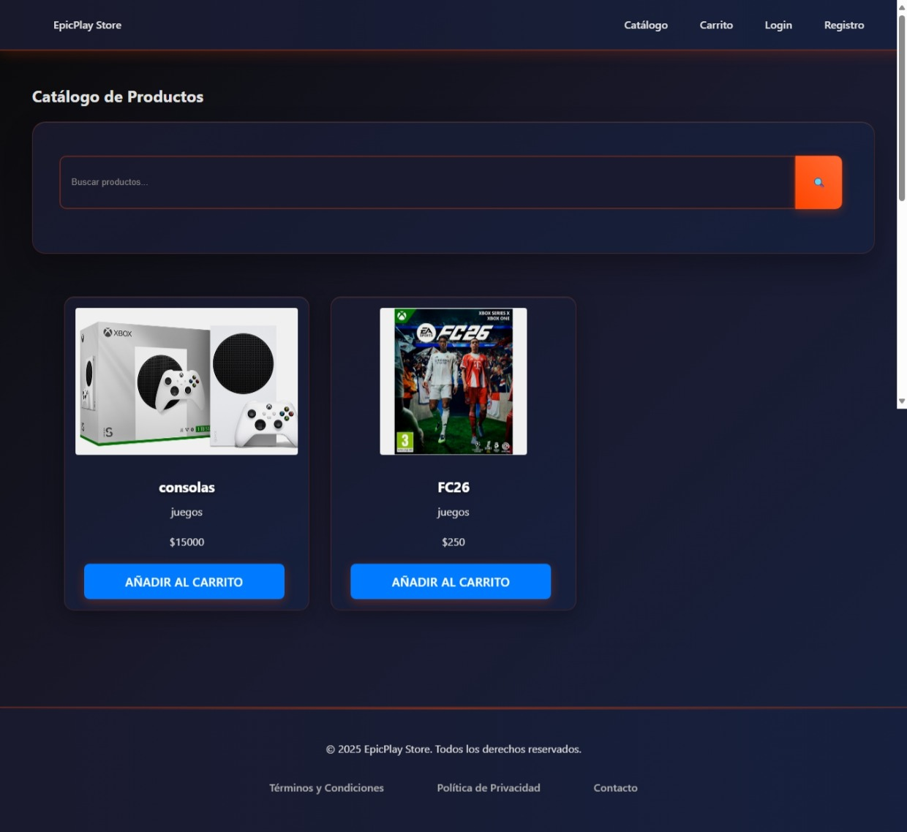

# E-commerce Game V.3

This is a full-stack e-commerce application for video games.

## Project Structure

The project is divided into two main parts:

-   `frontend/`: A React application created with Vite.
-   `backend/`: A Node.js and Express server.

## Application Screenshot



## Getting Started

### Prerequisites

-   Node.js
-   npm
-   PostgreSQL

### Backend Setup

1.  Navigate to the `backend` directory:
    ```bash
    cd backend
    ```
2.  Install the dependencies:
    ```bash
    npm install
    ```
3.  Create a `.env` file and configure your database connection and other environment variables.
4.  Start the server:
    ```bash
    npm start
    ```

### Frontend Setup

1.  Navigate to the `frontend` directory:
    ```bash
    cd frontend
    ```
2.  Install the dependencies:
    ```bash
    npm install
    ```
3.  Start the development server:
    ```bash
    npm run dev
    ```

The application should now be running on your local machine.
